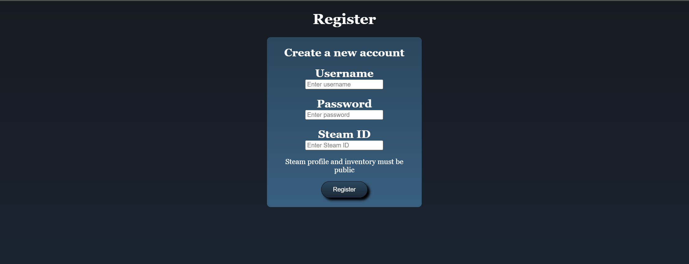
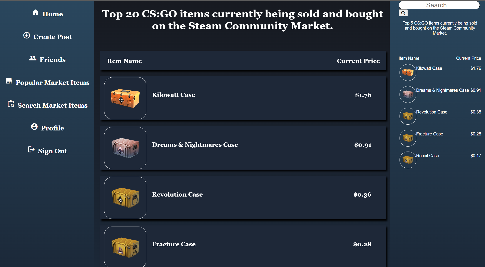
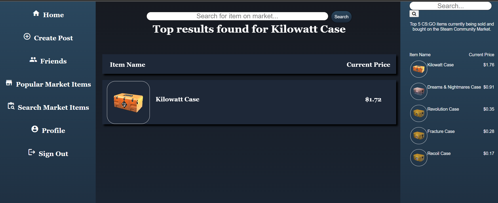

<p align="center">
  <a href="" rel="noopener">
 </a>
</p>

<h3 align="center">Steam Market for Skin</h3>

<div align="center">

[]()
[](https://github.com/Dhrumil-Rana/Flask_QA/issues)
[](https://github.com/Dhrumil-Rana/Flask_QA/pulls)
[](/LICENSE)

</div>

---

<p align="center">This Social Media project is for Steam users who love to buy/sell their Counter-Strike skins on the Steam platform. This project will help users market their skins in a different way. You can also chat with your friends and search through the most popular Steam Community Market items for Counter-Strike.
    <br> 
</p>

## 📝 Table of Contents

- [About](#about)
- [Getting Started](#getting_started)
- [Deployment](#deployment)
- [Usage](#usage)
- [Built Using](#built_using)
- [TODO](../TODO.md)
- [Contributing](../CONTRIBUTING.md)
- [Authors](#authors)
- [Acknowledgments](#acknowledgement)

## 🧐 About <a name = "about"></a>

Steam Community Market users would like to showcase and share their skins that are for sale through screenshots, public posts and friends in a way that is similar to social media platforms, and the current implementation on Steam does not work this way. This project is a web application that provides an interface for this while also acting as a social media platform complete with profiles, friends, messaging, image/text posts and comments.

## 🏁 Getting Started <a name = "getting_started"></a>

These instructions will get you a copy of the project up and running on your local machine for development and testing purposes. See [deployment](#deployment) for notes on how to deploy the project on a live system.

### Prerequisites

What things you need to install the software and how to install them.

```
This project uses postgreSQL and you need to create a database and then run the queries from **table.sql** to create a table.

Create a virtual environment:
python -m venv <name>
Activate it:
./<name>/bin/activate

Install required packages:
pip install -r requirements.txt

Run Flask app locally:
flask run
```

### Installing

A step by step series of examples that tell you how to get a development env running.

```
Run Flask app locally:
flask run

```
```
Login page
```
 <a href="" rel="Login Page">
 </a>

 ```
 Register Page
 ```
 <a href="/register" rel="Register Page">
 </a>

 ```
 Post page
 ```
 <a>
 </a>

 ```
 Top Market items (CS Go)
 ```
  <a>
 </a>
 
 ```
 search bar for items
 ```
   <a>
 </a>

 

## 🎈 Usage <a name="usage"></a>

- User needs to register first. Don't add your password directly in the database as I am using the bycrpyt to  encrypt the passwords. You need to give them the steam id as a mandatory field. Here is the sample steam id: 76561198262264130

- It is used for gamers to show their skins to other friends and it will also help users to talk about the skin they have bought or sold.


## 🚀 Deployment <a name = "deployment"></a>

- This code was deployed to heruko as a live server.
- Create an account in heruko 
- Create a database with schema name of public
- Create the tables in the postgresql in heruko using sql file provided in table.sql
- Connect this repo  to your heroku app by following instructions on [heroku](https://devcenter.heroku.com/articles/github-integration)
- Run the code. 

## ⛏️ Built Using <a name = "built_using"></a>

- [PostgreSQL](https://www.postgresql.org/) - Database
- [Flask](https://flask.palletsprojects.com/en/3.0.x/) - Server Framework
- [HTML](https://html.com/) -  For Building Markup pages
- [CSS](https://developer.mozilla.org/en-US/docs/Web/CSS) - To design the webpages  
- [JavaScript](https://www.javascript.com/)  - Used to make the website interactive
- [backpack.tf api](https://backpack.tf/api/index.html) - API  used to get data about user's inventories
- [Steam Community Market API](https://steamcommunity.com/market/) - API used to retrieve CS item prices and information

## ✍️ Authors <a name = "authors"></a>

- [@Dhrumil Rana](https://github.com/Dhrumil-Rana) - Methodology, Backend/Database, Website Deployment
- [@Alminb](https://github.com/alminb) - Idea, Website Code
- [@Gian](https://github.com/gco129) - Frontend/Design

## 🎉 Acknowledgements <a name = "acknowledgement"></a>
- Inspiration: Steam  Community Market
- References: https://backpack.tf/developer 
